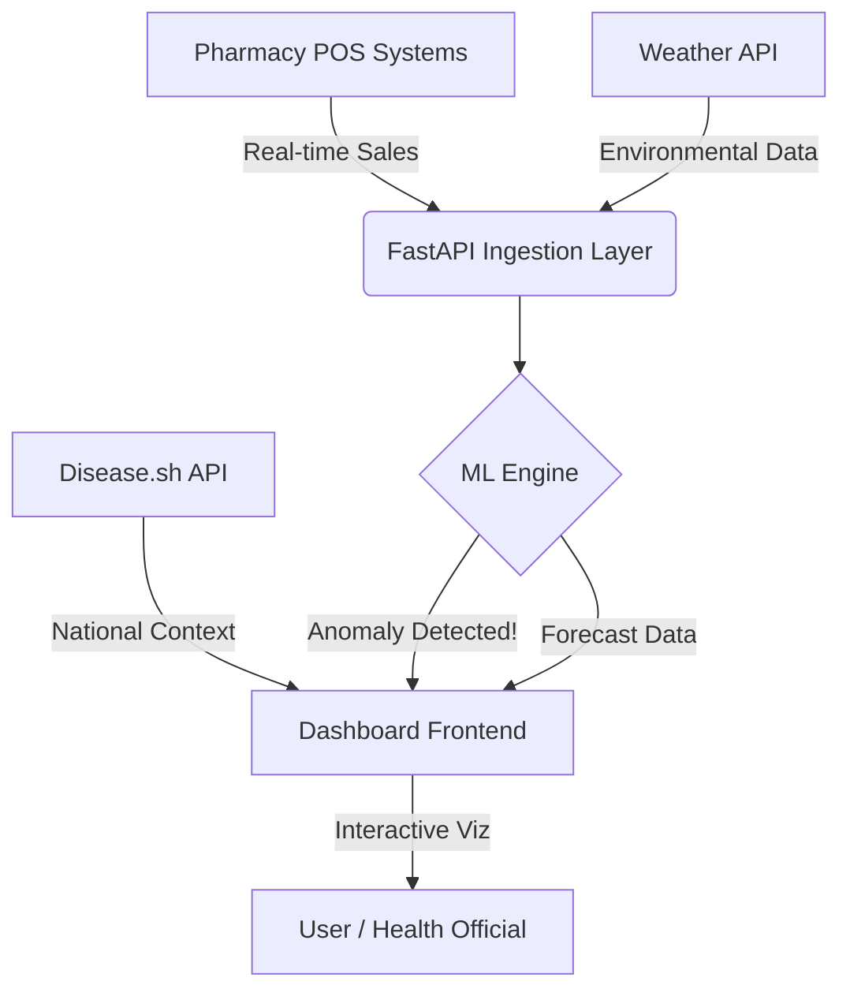

# ⚡ Flu Radar: Hyper-Local Disease Surveillance System

> **"Detecting Tomorrow's Outbreaks, Today."**

   

**Flu Radar** is an advanced **Hyper-Local Disease Outbreak Detection System** that correlates OTC pharmacy sales, real-time weather conditions, and national health data to predict and visualize disease hotspots before they become epidemics.

---

## 🔮 Live Dashboard Preview

<div align="center">
  <h3>✨ Glassmorphic Real-Time Interface ✨</h3>
  <p>The system features a state-of-the-art Command Center offering live insights.</p>
</div>

| **Real-Time Feed** | **Outbreak Heatmap** | **Predictive Engine** |
|:---:|:---:|:---:|
| 🟢 Live Transaction Stream | 🗺️ Geospatial Risk Index | 🤖 7-Day ML Forecast |
| 💊 Anomaly Detection | 🌡️ Weather Correlation | ⚠️ Spike Alerts |

---

## 🚀 Key Features

### 🖥️ **The Commander Dashboard**
*   **Animated UI**: Smooth, glassmorphic design with `framer-motion` and `lucide-react` icons.
*   **Dynamic Connectivity**:
    *   **Live Health Ticker**: Real-time integration with `disease.sh` for national COVID/flu stats.
    *   **Weather Engine**: Correlates outbreaks with local temperature/humidity via `wttr.in`.
*   **Resilient Architecture**:
    *   **Stale-While-Revalidate**: Zero-blink data refreshing.
    *   **Smart Skeletons**: beautiful loading states that never jar the layout.

### 🧠 **AI & ML Core**
*   **Anomaly Detection**: Uses **Isolation Forest** to flag unusual spikes in sales (e.g., sudden buying of Anti-Pyretics).
*   **Time-Series Forecasting**: **Prophet** models predict future case loads based on historical trends.
*   **Advanced Synthetic Data**: Logic-based generation of realistic pharmacy transactions, hospital admissions, and search trends.

### 🌐 **Full-Stack Performance**
*   **Backend**: FastAPI (Python) for high-performance ML inference.
*   **Frontend**: Next.js 14 (TypeScript) with Tailwind CSS for pixel-perfect responsiveness.
*   **Optimization**: `React.memo` and functional state updates for 60FPS UI performance.

---

## 🏗️ Architecture



---

## ⚡ Quick Start

### 1. Backend (Python/FastAPI)
Initialize the AI engine and serve the API.

```bash
# Install dependencies
pip install -r requirements.txt

# Download & Generate Datasets
python scripts/01_download_datasets.py
python scripts/06_generate_advanced_synthetic.py

# Train ML Models
python scripts/07_train_models.py

# Start Server
python -m uvicorn scripts.main:app --reload --port 8000
```

### 2. Frontend (Next.js)
Launch the visual command center.

```bash
cd flu-radar-dashboard
npm install
npm run dev
```

> 🌟 **Pro Tip:** Keep both terminals running to see live data streaming from the Python backend to the Next.js frontend!

---

## 📦 Project Structure

| Directory | Purpose |
| :--- | :--- |
| `scripts/` | **The Brain.** Python scripts for ML training, data generation, and API endpoints. |
| `flu-radar-dashboard/` | **The Face.** Next.js application with all UI components. |
| `datasets/` | **The Fuel.** Raw and processed CSV data for training models. |

---

## 🛠️ Tech Stack

*   **Frontend**: Next.js 14, Tailwind CSS, Recharts, Framer Motion, Lucide React
*   **Backend**: Python 3.10+, FastAPI, Uvicorn, Pandas, Scikit-learn
*   **External APIs**: Disease.sh (Epidemiology), Wttr.in (Weather)

---

<div align="center">
  <p><i>Built for the Future of Public Health Surveillance.</i></p>
  <p>💉 🦠 📉</p>
</div>
